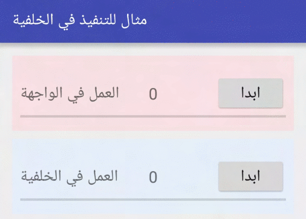

###برنامج بسيط يوضح فائدة تنفيذ بعض العمليات في الخلفية لكي لا تعطل عمل البرنامج

شرح هذا البرنامج موجود في المدونة على الرابط التالي:

 http://www.fadvisor.net/blog/2016/04/android_asynctask/

عرض لعمل البرنامج حيث نلاحظ الفرق بين التنفيذ في الواجهة حيث يتجمد التطبيق الى ان ينتهي العد ثم يعرض الناتج النهائي فقط
بينما باستخدام عمليات الخلفية حيث يتم العد في الخلفية والواجهة تعمل بشكل طبيعي وتعرض نتائج العد

